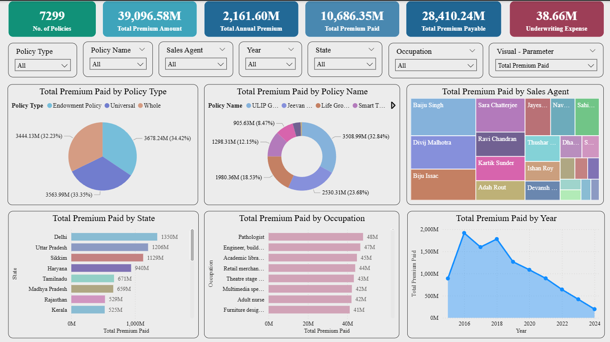
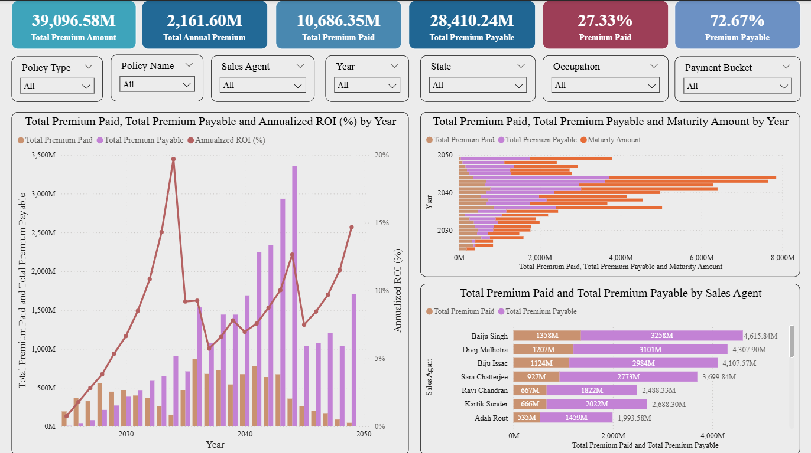

## Insurance Premium Analytics Dashboard (Power BI)

The **Insurance Premium Analytics Dashboard** is an interactive Business Intelligence solution developed using **Power BI** to analyze insurance policies, premium distribution, and business performance.

The dashboard transforms multiple relational datasets into a structured data model and provides visual insights into policy trends, customer distribution, and premium performance across regions.

This project demonstrates the use of **data modeling, DAX measures, and interactive visualizations** to support data-driven decision making in the insurance domain.

---

## Business Problem

Insurance companies manage large volumes of policy and premium data across customers, agents, and regions. Without a centralized analytics system, it becomes difficult to:

- Track premium performance across policy types
- Analyze customer distribution and policy adoption
- Evaluate agent performance
- Monitor regional and zonal business performance

This dashboard addresses these challenges by consolidating multiple datasets and presenting actionable insights through interactive visualizations.

---

## Tools & Technologies

- Power BI
- Data Modeling
- DAX (Data Analysis Expressions)
- Data Visualization

---

## Dataset Description

The dataset represents a structured insurance data warehouse model containing:

- Customer demographic details
- Insurance agent information
- Policy types and protection plans
- Regional and zonal management hierarchy
- Insurance policy transactions and premium values

These tables are connected through relationships to enable multi-dimensional analysis.

---

## Data Model / Architecture Overview

The dashboard is built using a **star-schema data model** consisting of one fact table and multiple dimension tables.

### Dimension Tables

- **DM.Customer_Detail_Table** – Customer demographic and profile information  
- **DM.Insurance_Agent_Table** – Details of insurance agents  
- **DM.Policy_Protection_Plan** – Protection plans associated with policies  
- **DM.Policy_Type** – Types of insurance policies  
- **DM.Regional_Manager** – Regional management hierarchy  
- **DM.Zonal_Manager** – Zonal management hierarchy  

### Fact Table

- **FCT.Insurance_Policy_Table** – Core transactional data including policy and premium details

The fact table contains transactional insurance policy data, while the dimension tables provide contextual information for customer demographics, policy types, protection plans, and organizational hierarchy.
These tables are connected through relationships to create a structured data model for analysis.

---

## Dashboard Insights

The dashboard provides insights into:

- Premium distribution across policy types
- Customer segmentation by policy ownership
- Agent performance and policy distribution
- Regional and zonal insurance performance
- Protection plan adoption patterns

Interactive filters allow users to analyze insurance metrics across multiple dimensions.

---


## Dashboard Preview

### Insurance Premium Dashboard



### Premium Analysis


---

## Project Structure

```
insurance-premium-analytics-dashboard
│
├── README.md
│
├── dashboard
│ └── Insurance_Premium_Dashboard.pbix
│
├── dataset
│ ├── DM.Customer_Detail_Table.csv
│ ├── DM.Insurance_Agent_Table.csv
│ ├── DM.Policy_Protection_Plan.csv
│ ├── DM.Policy_Type.csv
│ ├── DM.Regional_Manager.csv
│ ├── DM.Zonal_Manager.csv
│ └── FCT.Insurance_Policy_Table.csv
│
└── images
└── dashboard_overview.png
└── premium_analysis.png

```

## Key Insights

- Insurance premium revenue varies significantly across different policy types.
- Certain protection plans contribute a higher share of total premiums.
- Agent performance differs across regions and zones.
- Regional and zonal management structures influence policy distribution.
- Customer segmentation helps identify high-value policy holders.
